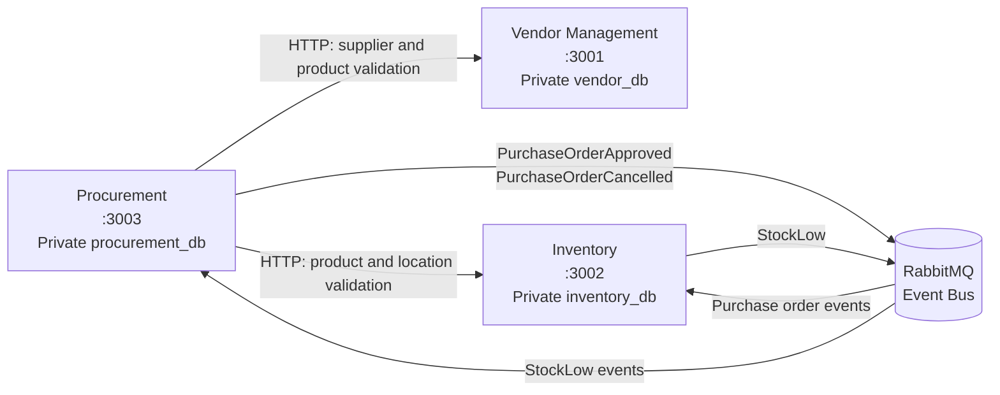

# Merchandising Management System

The Merchandising Management System (MMS) is a distributed retail backbone for
supplier management, purchasing, and stock control. It replaces disconnected
spreadsheets and manual handoffs with independent domain services that own
their data and communicate through HTTP APIs and RabbitMQ events.

## Architecture

Each service is an independently deployable island with a private PostgreSQL
database. REST is used for synchronous request/reply interactions. RabbitMQ
is used for asynchronous business events so a downstream service can recover
and process queued work after an outage.



No service reads another service's database. Cross-service identifiers are
validated through service contracts and are not backed by cross-database
foreign keys.

## Module directory

| Module | Directory | Purpose | Phase | Status |
| --- | --- | --- | --- | --- |
| Vendor Management | `services/vendor-management` | Supplier profiles, terms, product relationships, prices, lead times, and audit history | 1 | Backend implemented |
| Procurement | `services/procurement` | Purchase orders, approvals, amendments, cancellations, receipts, and reorder suggestions | 1 | Backend implemented |
| Inventory | `services/inventory` | Product master, locations, stock quantities, adjustments, valuation, and stock events | 1 | Backend implemented |
| Receiving | `services/receiving` | Physical goods validation and goods received notes | 2 | Planned |
| Warehouse Operations | `services/warehouse-operations` | Putaway, picking, transfers, and warehouse capacity | 2 | Planned |
| Retail Sales | `services/retail-sales` | Pricing, checkout, payments, returns, and sales events | 3 | Planned |
| Sales Audit | `services/sales-audit` | Register reconciliation and manager sign-off | 3 | Planned |
| Financials | `services/financials` | Ledger, accounts payable, inventory accounting, and profitability | 4 | Planned |

Phase 1 service-specific architecture and data-flow diagrams are available in
the [Vendor Management README](services/vendor-management/README.md),
[Procurement README](services/procurement/README.md), and
[Inventory README](services/inventory/README.md).

## Service endpoints

| Service | Port | Health | Readiness |
| --- | ---: | --- | --- |
| Vendor Management | 3001 | `/health` | `/ready` |
| Inventory | 3002 | `/health` | `/ready` |
| Procurement | 3003 | `/health` | `/ready` |

Business HTTP routes are versioned under `/api/v1`.

## Local development

Requirements: Node.js 22, pnpm 12.3.4, and Docker Compose.

1. Install dependencies:

   ```bash
   pnpm install
   ```

2. Start PostgreSQL databases and RabbitMQ:

   ```bash
   pnpm infra:up
   ```

3. Copy each service's `.env.example` to `.env`:

   ```bash
   cp services/vendor-management/.env.example services/vendor-management/.env
   cp services/procurement/.env.example services/procurement/.env
   cp services/inventory/.env.example services/inventory/.env
   ```

4. Apply all database migrations:

   ```bash
   pnpm db:migrate
   ```

5. Start the services in separate terminals:

   ```bash
   pnpm --dir services/inventory dev
   pnpm --dir services/vendor-management dev
   pnpm --dir services/procurement dev
   ```

RabbitMQ can be unavailable during startup. Services remain available for
HTTP requests and retry their messaging connections in the background.

Stop local infrastructure with `pnpm infra:down`.

## Feature flags

Phase 1 services are enabled by default. Later-phase services are disabled by
default. Set flags in a service's `.env` file before starting that service:

```text
FEATURE_VENDOR_MANAGEMENT_ENABLED=true
FEATURE_INVENTORY_ENABLED=true
FEATURE_PROCUREMENT_ENABLED=true
FEATURE_RECEIVING_ENABLED=false
FEATURE_WAREHOUSE_OPERATIONS_ENABLED=false
FEATURE_RETAIL_SALES_ENABLED=false
FEATURE_SALES_AUDIT_ENABLED=false
FEATURE_FINANCIALS_ENABLED=false
```

Disabled service routes and listeners are not registered. Use only `true` or
`false` values.

## API contracts

The OpenAPI specifications are the source of truth for the Phase 1 REST
contracts:

- [Vendor Management OpenAPI](contracts/openapi/vendor-management.yaml)
- [Procurement OpenAPI](contracts/openapi/procurement.yaml)
- [Inventory OpenAPI](contracts/openapi/inventory.yaml)

Swagger UI is not currently bundled into the services; use these versioned
specifications when exercising the APIs or generating client documentation.

## Testing

Run the standard Phase 1 test suite:

```bash
pnpm test
```

Run each service independently:

```bash
pnpm --filter @mms/vendor-management typecheck
pnpm --filter @mms/vendor-management test
pnpm --filter @mms/inventory typecheck
pnpm --filter @mms/inventory test
pnpm --filter @mms/procurement typecheck
pnpm --filter @mms/procurement test
```

Inventory integration tests use the disposable `inventory-test-db` container
on port `5436`. After all three services and infrastructure are running, the
cross-service purchase-order flow can be exercised with:

```bash
pnpm test:e2e
```

Continuous integration runs dependency installation, typechecks, builds, and
tests for all Phase 1 services in [.github/workflows/ci.yml](.github/workflows/ci.yml).
