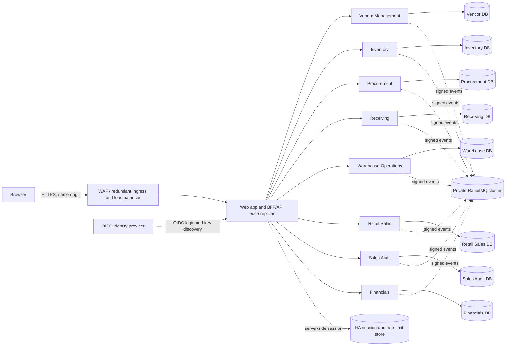

# MMS Security Architecture

**Status:** Proposed architecture; design only
**Date:** 2026-09-30
**Scope:** The eight backend services, web application, service-to-service traffic, messaging, and deployment edge.

## Goals

- Authenticate every human and workload identity.
- Enforce authorization in the service that owns each operation and record the verified actor.
- Protect high-impact business actions from abuse, replay, and excessive load.
- Keep any one replica, host, or infrastructure instance from taking the system offline.
- Preserve service-owned data and asynchronous integration boundaries.

Security controls are defense in depth. A gateway, CORS policy, or rate limiter never replaces service authorization, database constraints, idempotency, or audit records.

## Current state observed in the repository

- The web app uses a Vite development proxy to route API prefixes directly to eight local services. This is a development arrangement, not a production edge.
- Vendor Management, Inventory, Procurement, Receiving, Warehouse Operations, Retail Sales, Sales Audit, and Financials run as separate services and have separate databases.
- API contracts currently declare no authentication requirement. The services accept API requests without an authenticated principal.
- The browser supplies actor IDs in headers or request bodies, and the web client has configured actor IDs. These values can be forged and must not be used as proof of identity or permission.
- No shared production gateway, authentication middleware, CORS policy, or distributed rate limiter is evident in the current application setup.
- Zod is already used in many route handlers for request bodies, query parameters, path parameters, environment variables, and some event/client payloads. Coverage and error behavior are uneven, so this is useful validation already in place but not yet a complete validation boundary.
- Several services set a 1 MB JSON body limit, while Vendor Management, Inventory, and Procurement use Express's default JSON parser limit. All services need explicit, route-appropriate limits.
- Each service creates a PostgreSQL pool from its connection URL, but the inspected pool configurations do not set explicit maximum sizes or timeouts. The web router statically imports its page modules, so the initial bundle includes all routes unless the build tool splits them incidentally.
- The local Compose setup publishes database and RabbitMQ ports. These development ports must not be exposed in a production deployment.

This is a repository configuration review, not a deployment or cloud-account audit.

## Target topology

Deploy the web edge/BFF and ingress in at least two failure zones with health checks and rolling replacement. Only the edge has public ingress. Keep service APIs, databases, message broker, cache, and management consoles on private networks. Services should use direct private service discovery for internal calls rather than hairpinning through the public edge.

For the initial production deployment, serve the SPA and BFF on one origin (for example, `https://mms.example.com`). A WAF/CDN may sit in front of the redundant ingress where the hosting platform supports it. The ingress must route only known paths and hosts, reject malformed requests, terminate TLS, and set forwarded headers. Trust forwarded client-IP/protocol headers only from configured ingress hops.

The Vite proxy remains useful for local development. It must not be treated as production authentication or network isolation.

## Human authentication

Use an OpenID Connect (OIDC) provider; do not build password storage, login protocols, or token issuance in MMS. Prefer the organization’s existing identity provider if it meets availability, MFA, account lifecycle, and audit requirements. Otherwise select an OIDC-compliant provider as an infrastructure decision. Require MFA for finance approvers, administrators, and other privileged roles.

Use a Backend-for-Frontend (BFF) for the browser: the BFF performs OIDC Authorization Code flow with PKCE (S256), keeps access/refresh tokens server-side, and gives the browser an opaque session cookie. Use a high-entropy session identifier with `Secure`, `HttpOnly`, and `SameSite=Lax` (or `Strict` if navigation flows permit), narrow `Path`, and no broad `Domain`. Rotate the session on sign-in and privilege changes; enforce idle and absolute expiry; revoke server-side on logout and account disablement. Do not put bearer or refresh tokens in localStorage.

If a BFF cannot be deployed, the fallback is a public OIDC client using Authorization Code + PKCE, short-lived access tokens held in memory, and no client secret. Do not use the implicit or resource-owner-password grant. The BFF is preferred for this business application because it keeps tokens out of browser storage and naturally supports same-origin requests.

Keep identity-provider details out of business logic: shared authentication middleware validates OIDC and maps it into a stable internal principal (subject, employee ID, scopes/roles, and permitted resource context). Route and domain code consumes that principal interface, so the identity provider or token format can change without rewriting business rules. Use short-lived signed access tokens for API identity. Validate issuer, signature, allowed algorithm, audience, expiry, not-before, key ID, and required scopes. Use per-service audiences, not one unrestricted token for every API. Cache issuer metadata and JWKS with bounded refresh and key rotation so a temporary identity-provider/JWKS outage does not invalidate already issued tokens on every request. Do not make per-request introspection a hard dependency.

## Workload authentication and internal calls

- Give every service a separate workload identity. Use short-lived client-credentials tokens with explicit audience and narrow scopes for service-to-service calls.
- Use mTLS between workloads where the platform supports managed certificate identity; token validation remains necessary for authorization.
- For an action performed on behalf of a logged-in employee, retain a verifiable delegated user identity through a supported token exchange or signed delegation claim. Never accept a caller-provided `actorId` as the delegated identity.
- Event consumers authenticate to RabbitMQ with service-specific credentials and permissions. The broker is private, uses TLS, and has separate credentials/vhosts or equivalent least-privilege permissions. Event actor fields are audit context, not authorization credentials; producer identity and event provenance must be trusted through broker credentials and message validation.
- Use unique credentials and audience restrictions for every service. Rotate credentials; do not share the development `mms` broker credentials or broad database credentials in production.

## Authorization model

Adopt deny-by-default, service-enforced RBAC with resource attributes (location, store, register, ownership, amount, status) for contextual checks. Resolve the employee subject from the validated identity to a stable internal employee ID on the server. Authorization must be checked on every endpoint and every requested object, including list filters, exports, and nested IDs. Return a consistent 403 for authenticated but unauthorized callers and avoid leaking whether inaccessible resources exist.

A gateway may reject unauthenticated traffic and coarse-grained scopes, but each owning service must independently authenticate the caller and enforce function-level, object-level, and field-level authorization. This addresses the common API failure modes of broken object-level authorization, broken authentication, unrestricted resource consumption, and broken function-level authorization.

Initial role/scope map (refine against actual job duties and site assignments before enablement):

| Domain | Example permissions | Separation and checks |
| --- | --- | --- |
| Vendor Management | `vendors.read`, `vendors.write`, `vendors.manage` | Restrict management to procurement/vendor administrators; validate fields that may be changed. |
| Procurement | `purchase-orders.read`, `.create`, `.submit`, `.approve`, `.amend`, `.cancel` | Buyer submits; authorized approver approves; author cannot approve their own PO. Enforce amount thresholds and location/vendor scope. |
| Receiving | `receipts.read`, `receipts.record` | Restrict by assigned receiving location and PO; prevent over-receipt unless an authorized override is recorded. |
| Inventory | `inventory.read`, `inventory.adjust`, `inventory.manage` | Restrict adjustments by location; require reason and immutable audit record; require higher privilege/second approval above configured thresholds. |
| Warehouse Operations | `warehouse.operate`, `warehouse.adjust`, `warehouse.supervise` | Check source and destination locations, operation status, and supervisor-only overrides. |
| Retail Sales | `sales.checkout`, `sales.refund`, `sales.override`, `register.manage` | Bind cashier to permitted store/register; apply refund and price-override limits; preserve receipt idempotency. |
| Sales Audit | `sales-audit.read`, `.submit`, `.review`, `.approve` | Submitter and approver must be different identities; service enforces maker-checker and register/store assignment. |
| Financials | `financials.invoice.capture`, `.match`, `.approve`, `journal.post`, `accounts.manage`, `period.close`, `period.reopen`, `financials.read` | Invoice creator cannot approve their own invoice; journal posting and period close/reopen are separately privileged and fully audited; auditor role is read-only. |

Do not encode permissions solely as a broad `admin` flag. Central role assignment can be managed by the identity platform, but the service owns final policy decisions and business invariants. Permission changes and privileged operations must be audited.

## Rate limiting and resource controls

Use a shared, highly available Redis-compatible store or an equivalent managed distributed limiter at the edge for user/IP quotas. Apply additional domain-specific limits inside services so direct private calls and future topology changes remain protected. An in-memory limiter per replica is not sufficient because traffic can spread across replicas or restart to reset limits. Use token-bucket or sliding-window limits with explicit burst behavior. Return `429 Too Many Requests` with `Retry-After` and useful standard rate-limit headers.

These are conservative starting ceilings for production tuning, not permanent business rules. Load-test against expected store traffic and measure false throttles before enforcement. Key limits by authenticated subject and relevant business resource; use client IP only as a supplemental signal because many legitimate users can share NAT. Configure trusted proxy hops before using forwarded IPs.

| Operation | Initial limit | Additional controls |
| --- | --- | --- |
| General API | 300 requests/minute/user; 1,200/minute/IP; burst 30 | Per-route overrides; request timeout and concurrency limits. |
| Read/search/list | 120/minute/user per route | Page size max 100; require bounded search; cap response size and query time. |
| PO create/update | 30/minute/user | Validate state transition and idempotency key; per-PO submit/approve 3/minute. |
| PO submit/approve | 10/minute/actor | Maker-checker, amount thresholds, idempotent transition. |
| Receipt creation | 30/minute/user/location | Idempotency and PO quantity constraints. |
| Inventory/warehouse adjustments | 10/minute/actor/resource | Require reason; business approval threshold; serialize conflicting stock updates. |
| POS checkout | 120/minute/register and 60/minute/cashier | Tune per register throughput; idempotency key/unique receipt; do not throttle ordinary scans as if each were a sale. |
| Refund | 30/minute/cashier and 5/minute/receipt | Enforce return policy, amount threshold and manager override. |
| Sales Audit submit/review/approve | 10/minute/actor and 3/minute/session | Enforce session state and maker-checker; idempotent decisions. |
| Financial invoice capture/match | 30/minute/clerk | Deduplicate external invoice reference; cap attachment sizes and parsing work. |
| Financial approve/post/period controls | 5/minute/actor and 3/minute/document or period | Strong authorization, maker-checker, immutable posting and idempotency. |
| Reports, audit exports, trial balance | 10/minute/actor; max 2 concurrent/user | Authorization before query; bounded date range, pagination, async export for large results. |
| Sign-in failures | Configure at IdP: progressive delay and risk controls per account and source | Avoid permanent account lockout as an attacker-controlled denial-of-service mechanism; alert on sprays and repeated failures. |

The exact limits need refinement against route inventory and store volumes; the security properties to preserve are bounded request cost, fairness, and explicit protection for costly or irreversible actions. Rate limiting never replaces permissions, transactional constraints, replay protection, or auditability. Use idempotency keys for retryable writes and enforce uniqueness/transition rules in the database.

Define dependency-outage behavior in advance. If the distributed limiter is unavailable, the edge should alert and apply a conservative local emergency cap; high-risk financial/admin writes should fail closed with a retryable `503` if abuse controls cannot be established. Do not silently allow unlimited writes. Existing healthy sessions and normal read/checkout operations should not all be coupled to an identity-provider network check.

## CORS, CSRF, and browser protections

With a same-origin BFF, production browser API calls need no cross-origin CORS access: do not enable CORS globally by default. If an approved external browser client requires cross-origin access, allow only explicitly configured origins, methods, and headers; use `Vary: Origin`; never combine credentialed requests with `Access-Control-Allow-Origin: *`. Reject unexpected origins. CORS is a browser policy, not authentication or authorization.

Cookie-authenticated state-changing requests require CSRF protection: synchronizer or signed double-submit token, plus Origin (and where appropriate Referer) validation. SameSite cookies add protection but are not the sole CSRF control. Require JSON content types for API writes and reject unexpected simple content types.

Set security headers at the edge/application consistently: Content-Security-Policy tailored to the built UI, HSTS after HTTPS is complete, `X-Content-Type-Options: nosniff`, an appropriate frame policy, and a restrictive Referrer-Policy. Use secure output rendering, dependency updates, and avoid unsafe inline scripts. Set request body limits per route (small JSON defaults; explicit bounded upload routes), query depth/parameter caps, and timeouts.

## Input validation and API contract

Zod is the intended runtime validation library and is already used widely. Treat the current use as partial coverage: having Zod in dependencies does not prove that every entry point is validated. For every route, define and apply schemas to path parameters, query parameters, headers used by the API, and request bodies before domain logic or database work. Keep schemas close to the route contract and share types or generated OpenAPI where practical.

Validate cross-service HTTP responses and every message at the receiving boundary too; producer-side validation alone is insufficient. Validate environment/configuration at process startup and fail closed with a clear operator-facing startup error. Parse external data as `unknown`, then use `safeParse` or a shared validation adapter that returns the canonical client error shape. Do not return raw Zod issues, stack traces, or schema internals. Normalize and bound values (trim strings, set maximum lengths, bound arrays and nested object depth), reject unsupported content types, and reject unknown properties for sensitive write schemas where compatibility permits.

Use exact business representations: money as integer minor-unit amounts or decimal strings converted with decimal-safe arithmetic, never JavaScript floating-point money; quantities must match the domain's allowed integer/decimal precision and bounds. Validate UUIDs, enums, ISO dates, currency, numeric ranges, and required fields. Schema validation handles shape and range; domain rules still need explicit checks (for example, a PO state transition, available stock, actor separation, or invoice matching), and the database must enforce invariants that must remain true under concurrent requests.

Invalid input must stop before business side effects. Map validation failures to a stable `400` response with field-level messages that do not expose implementation details. Distinguish malformed JSON/oversized bodies (`400`/`413`) from valid JSON with invalid fields (`400`); use consistent safe errors for database and dependency failures. Never trust validation as authorization: a well-formed object ID still requires per-object access checks.

## API security controls (required baseline)

| Control | Required architecture | Current repository status / action |
| --- | --- | --- |
| HTTPS/TLS | TLS for all external traffic; TLS internally for service and data connections where supported; redirect or reject external plaintext HTTP. | Production ingress is not configured in this repository; deploy and enforce at the edge. |
| Authentication | OIDC human sign-in through BFF; authenticated workload identities for service calls. | Not implemented across APIs; do not treat actor IDs as authentication. |
| Authorization / RBAC | Deny by default; service-local operation, object, property, and location checks. | Not consistently implemented; add with verified principals. |
| Separation of duties | Enforce creator/approver separation and business thresholds in owning service and transaction. | Some workflow invariants exist, but actor IDs are currently caller-supplied; preserve and bind checks to authenticated subjects. |
| Service authentication | Audience-limited workload tokens, optionally mTLS; receiving service verifies identity and permission. | Internal integrations exist but need authenticated workload identity. |
| Rate limiting | Distributed edge quotas plus service-specific expensive-action limits. | Not evident; add after stable principal/IP attribution and define store-outage policy. |
| Input validation | Zod schemas on every external and cross-service boundary, then domain and database invariants. | Zod is already used broadly but coverage is incomplete; audit every route, event, and service client. |
| Request size limits | Explicit JSON limits per service and smaller limits per route; separate bounded upload handling. | 1 MB is set in some services; Vendor Management, Inventory, and Procurement currently use the parser default. Standardize explicitly everywhere. |
| CORS | Same-origin BFF: disabled by default. External browser clients: strict origin/method/header allowlist. | No production policy evident; avoid wildcard configuration. |
| Security headers | Apply established middleware/edge policy for CSP, HSTS, frame protection, MIME sniffing, and referrer policy. | No consistent middleware evident; configure at edge and app where defense in depth is useful. |
| Safe errors | Stable client contract; no stack, SQL, secrets, or internal topology in responses. | Per-service handlers exist but should be reviewed for identical redaction and request correlation. |
| Audit logging | Record verified human/workload actor, action, resource, decision, and time; protect retention. | Domain audit records exist in services; migrate actor source to verified identity and aggregate protected security events. |
| Request IDs | Accept a validated edge-generated correlation ID or generate one; propagate to services, events, logs, and responses. | Add consistently across edge and services; never use the ID as an identity or authorization credential. |
| Secrets | Secret manager, least privilege, rotation, and no production secrets in source/env bundles/logs. | Local `.env` usage is for development; production injection and rotation remain deployment requirements. |

Use established middleware for HTTP security headers and request parsing rather than hand-building headers. API response errors must expose a safe message, stable error code/category, field details where useful, and request ID; log detailed diagnostics only to protected server logs. Never send credentials, stack traces, SQL text, internal hostnames, or dependency configuration to clients.

## Scaling and capacity

### API and worker scaling

Keep HTTP service replicas stateless: no in-process sessions, lock state, or correctness-critical counters. Run multiple replicas across failure zones behind health-checked ingress; scale using a combination of request rate, p95/p99 latency, CPU/memory, event-loop lag, and queue depth. Set resource requests/limits and graceful shutdown so a replica stops receiving traffic, finishes bounded in-flight work, and releases database/broker connections. Keep liveness checks cheap; readiness should reflect the dependencies required to serve that service's routes.

Apply connection, request, and downstream timeouts; bounded retries with jitter only for safe/idempotent operations; circuit breakers and concurrency caps for calls to another service. Avoid retry storms and do not report a write as successful when its durable transaction failed. Move CPU-heavy reports, bulk imports, and large exports to bounded background jobs with status/progress APIs and per-tenant/user quotas. Use the transactional outbox for reliable event publication and idempotent consumers.

### Database scaling

Preserve the current service-owned database boundaries. Scale in this order, measuring before each step:

1. Establish per-service baselines: query p95/p99, slow query log, CPU/IO, lock waits, pool wait time, active connections, cache hit ratio, table/index growth, and replication lag. Alert before connection or storage exhaustion.
2. Improve query shape: inspect plans with `EXPLAIN (ANALYZE, BUFFERS)` in safe environments, add indexes for measured access patterns, avoid N+1 calls, select only needed columns, paginate all lists, and prefer keyset pagination for deep/high-volume histories. Keep transactions short and use constraints/unique indexes for concurrency-sensitive invariants.
3. Bound connection pools. Set explicit per-process pool maximum, connection/acquire/idle timeouts, and application concurrency. Budget `replica count × pool max` across every service against database connection capacity, reserving connections for migrations, monitoring, failover, and operations. Add PgBouncer or the platform's connection pooler when connection churn/replica counts justify it; verify transaction-pooling compatibility with the driver's prepared-statement behavior.
4. Scale database compute/storage vertically and provision IOPS based on observed load. Use HA primary/standby and point-in-time recovery for availability and recovery; replicas alone are not backups.
5. Add read replicas only for measured read-heavy workloads and route explicitly stale-tolerant reads to them. Keep writes, financial posting/approval, read-after-write screens, and consistency-sensitive stock decisions on the primary unless the domain contract explicitly allows replica lag.
6. Consider partitioning large append-only audit/event/history tables by time when measured table size and query/retention patterns justify it. Archive or expire data under approved retention rules. Do not introduce cross-service joins or sharding before metrics demonstrate the need; keep money/stock invariants transactional within their owning service.

Every service must have a connection budget and capacity alert. Autoscaling app replicas without pool budgeting can exhaust PostgreSQL and turn a traffic spike into a shared outage.

### Frontend and static asset scaling

Serve the production frontend as versioned static assets through a CDN or equivalent cache in front of redundant static hosting. Use content-hashed filenames with long immutable cache headers; serve the HTML entry point with revalidation/no-cache so deployments pick up new asset hashes. Enable Brotli or gzip, HTTP/2 or HTTP/3 where supported, and use a restrictive CSP compatible with the built app. Keep API traffic on the same public origin through the BFF.

The current router eagerly imports all pages. Add route-level code splitting with `React.lazy`/dynamic imports and route-level `Suspense` fallbacks as the UI grows; inspect production bundle reports and split oversized feature/vendor chunks. Load heavy charts, export tooling, and infrequently used workflows on demand. Keep list screens paginated and virtualize genuinely large tables; do not fetch entire audit or inventory histories to render a page.

Use the existing TanStack Query cache intentionally: stable query keys, appropriate `staleTime`/`gcTime`, request cancellation, deduplicated fetches, and targeted invalidation. Avoid aggressive polling across every page; use bounded refresh intervals or event-driven updates for operational views. Cache only data safe for that user/session, clear user-scoped cache on logout or identity switch, and never treat a frontend feature gate or cached permission as authorization.

## Network, data, and secrets

- Public access: only the load balancer/ingress. Service ports, PostgreSQL, RabbitMQ and its management UI, Redis, and admin endpoints are private. Restrict egress to required dependencies.
- TLS: HTTPS externally and TLS for service, database, broker, and cache connections where supported. Encrypt persistent data and backups at rest with managed keys.
- Database: retain one owning database per service. Use a distinct application DB role per service, least-privilege grants, no schema-owner/superuser credential in runtime, bounded connection pools, and secret rotation. Use parameterized queries and database constraints for invariants.
- Secrets: inject from a secret manager; do not commit production secrets to `.env`, container images, logs, or frontend bundles. Rotate on staff departure or suspected exposure.
- Data: classify PII and financial records; minimize fields in logs and events; establish retention and deletion requirements. Avoid tokens, session cookies, payment credentials, or full sensitive payloads in logs.
- Backups: point-in-time recovery and encrypted backups for each database; regularly prove restore procedures, not just backup creation.

## Availability and single points of failure

| Dependency | Failure mitigation | Degraded behavior |
| --- | --- | --- |
| DNS / TLS / ingress | Managed redundant DNS; multi-zone ingress/LB; certificate automation and expiry alerts. | Serve a maintenance response if no healthy web edge exists. |
| Web/BFF/API edge | At least two stateless replicas in separate failure zones; health checks, rolling deploys, autoscaling and circuit breakers. | Edge is an unavoidable entry dependency; fail over replicas and avoid storing business state locally. |
| OIDC provider | Prefer provider HA and documented account lifecycle; cached issuer/JWKS for existing signed tokens; monitor callback and key retrieval. | Existing valid sessions/tokens continue within expiry; new login may pause. Do not bypass authentication. |
| Session/rate-limit store | Managed HA/cluster, replica/failover, TLS, backups where session persistence is required, alerts and tested recovery. | Re-authenticate if sessions are lost; emergency caps and fail-closed policy for high-risk writes if limiter fails. |
| Each service | Multiple replicas where capacity and deployment permit; readiness/liveness checks; bounded retries/timeouts; isolate pools and circuit-break cross-service calls. | Fail only workflows that depend on the unhealthy service; return actionable retryable errors. |
| Per-service PostgreSQL | HA primary/standby or managed HA, PITR, tested restore/failover, per-service connection budgets. | A database incident affects its owning service; do not route around ownership or report a write as successful. |
| RabbitMQ | Multi-node quorum queues across failure zones, persistent messages, per-service permissions, monitored disk/memory/queue depth and DLQs. | Transactional outboxes retain events for replay; alert and bound backlog; consumers are idempotent. |
| Secrets/KMS | Managed service redundancy, access logging, rotation, recovery/break-glass runbook. | Never fall back to committed/default secrets. |

No design can remove all dependencies: the public edge remains the ingress dependency, and a service’s own database is necessary for its writes. Redundancy, recovery, bounded failure domains, and explicit degraded behavior prevent a single instance failure from becoming a system-wide outage. Avoid a single central authorization process: validate identity and enforce policy in each service, with the edge as an additional boundary.

## Logging, detection, and audit

Emit structured security events for authentication success/failure, authorization denial, role changes, rate-limit rejection, account disablement, token validation failure, service identity, and privileged business actions. Include request/correlation ID, verified subject/service identity, action, resource type/ID, decision, and timestamp. Never log bearer tokens, cookies, secrets, or unrestricted request bodies.

Forward protected audit/security logs to a centralized, access-controlled destination with retention and tamper-resistance appropriate to financial records. Alert on credential spraying, repeated object-access denials, unusual refund/adjustment activity, unexpected period operations, high 429/5xx rates, queue dead letters, backup failures, and certificate/secret expiry. Keep business audit records in their owning domain service and use central aggregation for cross-service investigation.

## Implementation and rollout

1. **Baseline and decisions:** Inventory routes and data classifications; finalize the role/scope matrix, location/store assignment rules, sign-in provider, session lifetime, retention, and deployment availability objectives. Threat-model money movement, stock changes, identity lifecycle, and service messaging.
2. **Production edge and network:** Deploy HTTPS ingress and redundant web/BFF replicas; make service and infrastructure ports private; remove default/shared credentials; apply body size, timeout, header, and request limits. Keep the local Vite proxy for development only.
3. **Authentication foundation:** Integrate OIDC and BFF sessions; implement shared token-validation and principal-resolution middleware; add CSRF protections and security event logging. No production route should rely on browser-supplied actor IDs.
4. **Service authorization:** Migrate one service at a time to verified principals and service-local policies. Enforce object and field access, store/location scope, and maker-checker/amount policies. Replace actor headers/body fields with server-derived actor IDs while keeping explicit trusted service identities for automated work.
5. **Workload identities and events:** Add scoped client credentials/mTLS to internal APIs, broker ACLs, provenance checks, credential rotation, and consumer idempotency.
6. **Abuse and resilience controls:** Add shared distributed limits plus service-level business quotas, concurrency/time limits, alerts, circuit breakers, HA cache/DB/broker arrangements, backup/restore and failover runbooks. Tune thresholds from representative load observations.
7. **Enforcement and review:** Enable production policies by service with deny-by-default. Review authorization and rate-limit coverage for every route, perform security assessment, exercise recovery and incident procedures, and rotate/remove transitional credentials.

Authentication and authorization must be enabled together for each production route; do not expose a partially migrated service publicly. During development, use a clearly separated local-only identity stub or seeded test identity, never a production bypass.

## Acceptance criteria

- Every public API request reaches the edge over HTTPS; no backend, database, broker, cache, or admin port is public.
- Every route validates path, query, headers, and body with bounded schemas; cross-service HTTP responses, events, and startup configuration are validated at their receiving boundary.
- Every service has an explicit body-size limit, bounded pagination, safe validation errors, and request IDs in responses/logs.
- Every service rejects missing, invalid, expired, wrong-audience, or insufficient-scope identities.
- Services derive actor IDs from validated principals and enforce resource/store/location access locally.
- Maker-checker, approval thresholds, idempotency, and financial/stock invariants are server- and database-enforced.
- CORS is disabled for the same-origin BFF, or strictly allowlisted for an approved cross-origin client; cookie writes have CSRF protection.
- Expensive reads and high-impact writes have distributed limits, bounded payloads, timeouts, concurrency controls, monitoring, and documented limiter-outage behavior.
- Loss of one edge/service/cache/broker/database replica has a tested, bounded recovery path; database and event replay procedures are documented and exercised.
- Replica and DB pool budgets fit the configured PostgreSQL connection limits; scaling thresholds and alerting use observed latency, saturation, and queue metrics.
- Frontend production assets are cached/versioned and feature routes are split on demand; high-volume lists use server pagination.
- Security and business audit logs identify the verified actor and decision without exposing credentials or sensitive payloads.

## References

- IETF, [OAuth 2.0 Security Best Current Practice (RFC 9700)](https://www.rfc-editor.org/rfc/rfc9700/)
- OWASP, [API Security Top 10 (2023)](https://api-security.owasp.org/editions/2023/en/0x11-t10/)
- OWASP, [REST Security Cheat Sheet](https://cheatsheetseries.owasp.org/cheatsheets/REST_Security_Cheat_Sheet.html)
- OWASP, [Cross-Site Request Forgery Prevention Cheat Sheet](https://cheatsheetseries.owasp.org/cheatsheets/Cross-Site_Request_Forgery_Prevention_Cheat_Sheet.html)
