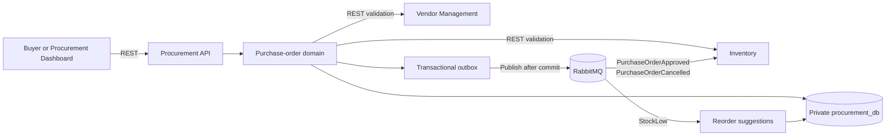

# Procurement Service

The Procurement service owns the organization's purchase commitments. It is
the authoritative source for purchase orders, purchase-order lines, agreed
unit prices, totals, approval state, lifecycle state, amendments,
cancellations, receipt quantities, and procurement audit records.

It does not own supplier master data, current supplier terms, Product Master
data, inventory quantities, or another service's database.

## Responsibilities

- Create and view purchase orders.
- Validate suppliers and supplier-product relationships through Vendor
  Management.
- Validate products and destination locations through Inventory.
- Calculate line totals and purchase-order totals.
- Submit orders for approval and enforce separation between creator and
  approver.
- Approve, reject, send, amend, cancel, and receive purchase orders.
- Preserve approved commercial terms as historical data.
- Record auditable state changes.
- Publish purchase-order events through the transactional outbox.

## Purchase-order lifecycle

```text
DRAFT -> PENDING_APPROVAL -> APPROVED -> SENT
                                      -> PARTIALLY_RECEIVED -> COMPLETED
```



Controlled cancellation is supported for eligible states. Cancellation is a
state transition and does not delete the purchase order. The remaining
unreceived quantity is recorded and published for Inventory to remove from
`quantityOnOrder`.

Approved commercial terms are locked. Changes to an approved order must use
the amendment workflow and retain the original order history.

## Data ownership

Procurement owns:

- Purchase orders and purchase-order lines.
- Ordered and received quantities.
- PO-specific unit prices and calculated totals.
- Approval and lifecycle state.
- Amendments and cancellation records.
- Procurement audit records.
- Transactional outbox records.

Vendor Management owns supplier identity, supplier status, supplier-product
relationships, and current supplier terms. Inventory owns Product Master,
locations, and stock quantities. Cross-service references are identifiers;
there are no cross-service foreign keys.

## Service contracts

Before a purchase order can be created or submitted, Procurement uses the
configured service APIs to validate the relevant supplier, supplier-product
relationship, product, and destination location. Procurement never queries
the Vendor Management or Inventory databases directly.

Environment variables:

```text
DATABASE_URL
PORT                  # defaults to 3003
RABBITMQ_URL          # defaults to amqp://localhost:5672
VENDOR_SERVICE_URL    # defaults to http://localhost:3001/api/v1
INVENTORY_SERVICE_URL # defaults to http://localhost:3002/api/v1
```

Copy `.env.example` to `.env` for local development. Secrets and local
environment files must not be committed.

## HTTP API

All business routes are versioned under `/api/v1`.

| Method  | Route                             | Purpose                        |
| ------- | --------------------------------- | ------------------------------ |
| `POST`  | `/purchase-orders`                | Create a draft purchase order  |
| `GET`   | `/purchase-orders/:id`            | Retrieve a purchase order      |
| `PATCH` | `/purchase-orders/:id`            | Update an eligible draft       |
| `PATCH` | `/purchase-orders/:id/submit`     | Submit for approval            |
| `PATCH` | `/purchase-orders/:id/approve`    | Approve a submitted order      |
| `PATCH` | `/purchase-orders/:id/reject`     | Reject a submitted order       |
| `PATCH` | `/purchase-orders/:id/send`       | Mark an approved order as sent |
| `PATCH` | `/purchase-orders/:id/cancel`     | Cancel an eligible order       |
| `POST`  | `/purchase-orders/:id/receipts`   | Record received quantities     |
| `POST`  | `/amendments/purchase-orders/:id` | Request an amendment           |
| `PATCH` | `/amendments/:id/approve`         | Approve an amendment           |
| `PATCH` | `/amendments/:id/reject`          | Reject an amendment            |

Operational endpoints are available outside the API version:

- `GET /health` confirms that the process is running.
- `GET /ready` checks database and RabbitMQ readiness.

Request bodies are validated at the API boundary. Errors use the service's
standard application error handler and return controlled status codes rather
than database or stack-trace details.

## Events and reliability

Approval and cancellation changes are committed with an outbox record in the
same database transaction as the purchase-order change. A background
publisher sends pending records to the durable `mms.events` RabbitMQ exchange
and marks them published only after broker confirmation.

The publisher uses a PostgreSQL advisory lock so multiple Procurement
instances do not publish the same pending records concurrently. It retries a
failed record up to three attempts before marking it failed for operational
follow-up.

The current event types are:

- `PurchaseOrderApproved`: Inventory increases `quantityOnOrder`; it does not
  increase physical stock.
- `PurchaseOrderCancelled`: Inventory removes only the remaining unreceived
  quantity from `quantityOnOrder`.
- `PurchaseOrderReceived`: emitted when Procurement records accepted receipt
  quantities for the current receiving workflow.

Inventory consumers are idempotent using event identifiers. Procurement does
not require Inventory to be available during approval or cancellation; the
outbox decouples the state change from publication and retries failed
publication attempts.

The current event envelope contains the event ID, type, aggregate metadata,
payload, occurrence time, and RabbitMQ message ID. A versioned envelope with
explicit `producer` and `version` fields is planned as a contract-hardening
follow-up.

## Database and migrations

Procurement uses its own PostgreSQL database and Drizzle ORM. Schema changes
are stored in `drizzle/` and must be applied through the service migration
script:

```bash
pnpm --dir services/procurement db:migrate
```

The primary tables cover purchase orders, lines, approvals, amendments,
cancellations, audit logs, and outbox events.

## Local development

From the repository root:

```bash
pnpm infra:up
pnpm --dir services/procurement db:migrate
pnpm --dir services/procurement dev
```

The default local Procurement port is `3003`. Vendor Management and
Inventory should be running when exercising supplier and product validation.

## Testing and validation

Run the Procurement checks from the repository root:

```bash
pnpm --filter @mms/procurement typecheck
pnpm --filter @mms/procurement test
```

The test suite covers creation, validation, submission, approval and
rejection, sending, cancellation, amendments, receipt quantities, audit
records, outbox publication, and failure responses.

The current Procurement suite contains 49 passing tests.

## Current implementation boundary

This service implements the Phase 1 procurement workflow. Physical receiving
is represented through the current Procurement receipt endpoint so ordered,
received, and remaining quantities can be tracked. A future dedicated
Receiving service may take ownership of physical receipt records while
continuing to publish an explicit contract to Inventory.

Authentication, authorization, service-to-service credentials, machine-
readable OpenAPI contracts, and production deployment controls remain
platform-level follow-up work for the Phase 1 production Definition of Done.

The current API uses validated request data and actor identifiers supplied by
the caller. Those identifiers are not yet backed by an authentication or
authorization system. A configurable PO value limit and feature flag are
also not implemented in this service yet.
